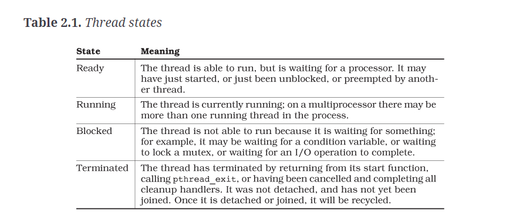
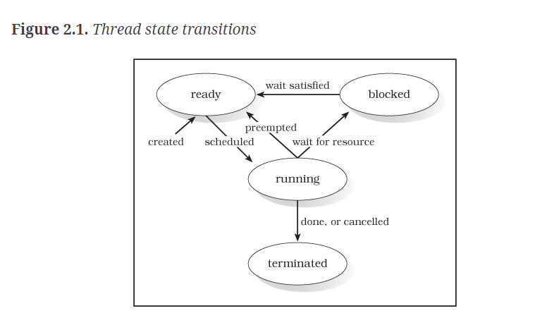

# Chapter 2 Notes

At any given instant, a thread is in one of four basic states:

1. Ready - The thread is able to run, but is waiting for a processor. It may have just started, or just have been unblocked, or preempted by another thread.

2. Running - The thread is currently running: on a multiprocessor there may be more than one running thread in the process.

3. Blocked - The thread is not able to run because it is waiting for something; for example, it may be waiting for a condition variable, or waiting to lock a mutex, or waiting for an I/O operation to complete.

4. Terminated - The thread has terminated by returning from its start function, calling `pthread_exit`, or having been cancelled and completing all cleanup handlers. It was not detached, and has not yet been joined. Once it is detached or joined, it will be recycled.

In terms of thread creation, there is no synchronization between when `pthread_create` returns, and the scheduling of the new thread that was created. It's possible for the new thread to start or even run to completion before `pthread_create` returns.

A thread starts from an initial sequence of instructions, which eventually lead to the thread_start function provided as the last argument to `pthread_create`.

A thread spends most of its active life in three states: ready, running and blocked.
