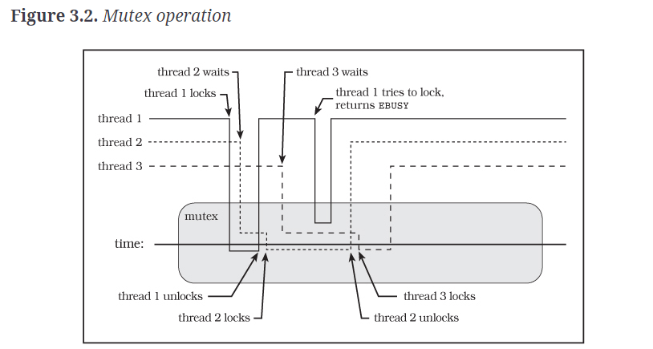
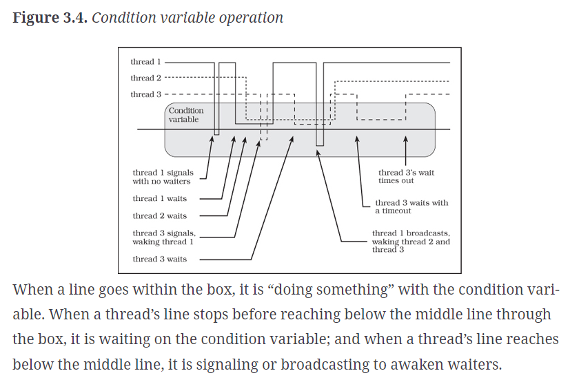

# Chapter 3 Notes

- Critical sections are areas of code that affect shared state.
- Critical sections generally need to protect some data invariant, or assumption that must remain about the data being operated on
- Invariants can be broken generally, it's just that they're repaired before another thread can access the data. Synchronization is the voluntary act of protecting your system from broken invariants.
- Predicates are the logical expressions that describe the state of invariants needed by your code
- The most common way to synchronize data between threads is to ensure that all memory access to the same data remains mutually exclusive
- Pthreads provide mutual exclusion through mutexes

A visual of a mutex guarding some data. Whenever a threads line is below the bold `time` line is when it has made a successful lock on the mutex.

We can statically and dynamically initialize mutexes. Static initialized mutexes are available through the `PTHREAD_MUTEX_INITIALIZER`. Dynamically allocated mutexes should be initialized through `pthread_mutex_init`, or or some other means, it just can't be aforementioned PTHREAD_MUTEX_INITIALIZER macro.

It is difficult for anyone to guarantee atomicity in a program (i.e., where threads don't ever detect invariants that change), but leveraging synchronization through mutexes allows you to sidestep that issue somewhat. You just need to ensure that all threads are using the same mutex for a given data structure.

A condition variable is how threads can communicate about the status of a dataset and its corresponding mutex.

A conditional variable should never be copied, but of course can be shared by passing pointers
